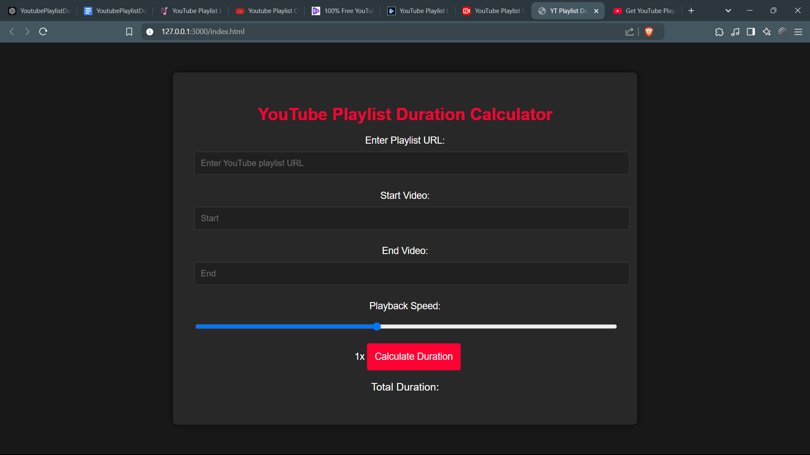

# YouTube Playlist Duration Calculator

A responsive web application that allows users to calculate the total duration of a YouTube playlist. Users can enter a playlist URL, adjust the playback speed, and specify a range of videos to calculate the duration for a subset of the playlist. The website offers an intuitive interface with YouTube-inspired branding and an adaptable layout.

## Features

- **Playlist Duration Calculation**: Input a YouTube playlist link to get the total duration.
- **Adjustable Playback Speed**: Select different playback speeds (0.25x to 2x) and view the adjusted duration.
- **Video Range Selection**: Specify a start and end video number within the playlist to calculate the duration of a selected range.
- **Responsive Layout**: The interface is styled to use screen space effectively, with a YouTube-like dark theme and branded color scheme.

## Technologies Used

- **HTML**: Structure the webpage content.
- **CSS**: Styling and branding with a dark theme inspired by YouTube's design.
- **JavaScript**: Handles the YouTube API interaction, dynamic UI updates, and duration calculation.
- **YouTube Data API v3**: Retrieves playlist and video information to calculate the total duration.

## Prerequisites

- **YouTube API Key**: You’ll need a YouTube API key to access playlist data. Follow the steps in the [Google Cloud Console](https://console.cloud.google.com/) to create a project, enable the YouTube Data API v3, and generate an API key.

## Installation

1. **Clone the Repository**:
    ```bash
    git clone https://github.com/YOUR_USERNAME/YT-Playlist-Duration-Calculator-Website.git
    cd YT-Playlist-Duration-Calculator-Website
    ```

2. **Add API Key**:
    - Open the `script.js` file.
    - Replace `'YOUR_API_KEY'` with your actual YouTube API key.

3. **Run Locally**:
    - Open `index.html` in a web browser to test the application locally.

## Usage

1. **Enter the Playlist URL**: Paste the YouTube playlist link into the text box.
2. **Set Video Range** (optional): Enter the start and end video numbers within the playlist to calculate a subset. Leave empty to calculate the entire playlist duration.
3. **Adjust Playback Speed**: Use the slider to select a speed, and view the adjusted duration.
4. **Calculate Duration**: Click "Calculate Duration" to see the total or adjusted playlist duration.

## Code Overview

- **index.html**: Contains the main layout, including input fields, buttons, and the result display area.
- **style.css**: Styles the interface with a responsive layout and YouTube-inspired theme.
- **script.js**: Handles API calls, retrieves playlist data, calculates durations, and dynamically updates the UI based on user input.

## Example Usage

1. **Input**: A valid YouTube playlist URL, with optional start and end video numbers.
2. **Output**: Total duration displayed in hours, minutes, and seconds, with optional adjustments for playback speed.

## Screenshot



## Deployment

You can deploy this site easily with:
- **GitHub Pages**: Push the repository to GitHub and enable GitHub Pages in the repository settings.
- **Netlify** or **Vercel**: For a free, easy deployment. Just connect your GitHub repository to either platform and deploy.

---

Enjoy using the YouTube Playlist Duration Calculator! Feel free to contribute by opening issues or pull requests.

